# ArchiveDiffusion: Authenticity-Preserving Restoration of Public-Domain Film Stills
## Jake Barrett

ArchiveDiffusion is a small-scale research and engineering project combining my love of old film with curiosity of new computer vision techniques. I will explore how diffusion-based image restoration can improve degraded archival film stills while preserving their original cinematic character - we don't want to yassify Boris Karloff, just lovingly restore the frames. The project is designed as a local and reproducible modelling study, with a clear path from foundational DDPM training to practical restoration, evaluation, and accelerated sampling experiments.

The project begins with a compact DDPM-style baseline and extends toward paired restoration using synthetic degradation, quantitative metrics, qualitative analysis, and sampling-speed experiments. The project is a v1 implementation, developing my knowledge of diffusion-based modeling, establishing a supervised ML pipeline, and playing around with archival films; there are multiple next steps listed for progression in Section 12.

  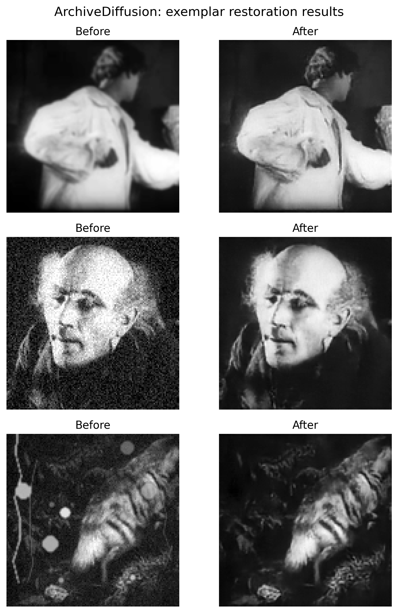

Figure 1: ArchiveDiffusion results. Each row shows a degraded archival input frame (left) corroded with (i) blur, (ii) static, and (iii) scratches, and the corresponding restored output (right) from a high-performing conditional DDPM model.

## 1. Motivation

Inspired by a readthrough of Mark Cousins' "The Story of Film", many archival film stills contain grain, scratches, blur, low contrast, and other forms of degradation. Modern generative image models can enhance or hallucinate detail, but restoration can easily become over-smoothed, ahistorical, or aesthetically inauthentic. This project asks: can diffusion-based restoration improve archival film still quality while preserving the period-specific texture and visual identity of the source material? And is this possible on a 6-year-old i5 HP EliteBook combined with a general reticence to pay for a single penny of compute?

My main goals were to establish a pipeline for further iterative improvements and improve my practical experience with diffusion models, taking care to avoid over-smoothing and synthetic appearance in outputs. With the available compute being a local laptop, early stopping and concept demonstration are core features of this project; I aim to learn what can be done and scaled up rather than perfecting the process.

Note that a command log and all scripts are included in this repo, so results should be fully reproducible; if there are any issues getting things working, please get in touch! Note also that a good chunk of this report and the underlying code have been built with my research assistant ChatGPT (5.4 and 5.5). The important stuff is handwritten, but apologies for any legacy "here's the code you asked for" comments and repo artifacts.

## 2. Research question

"Can diffusion-based restoration improve degraded archival film stills while preserving their period-specific visual character?"

## 3. Background

Diffusion models are generative models that learn to reverse a gradual noising process. In a denoising diffusion probabilistic model (DDPM), training begins with a clean image and progressively adds Gaussian noise over a fixed number of timesteps. At early timesteps the image is only slightly corrupted; at late timesteps it approaches pure noise. The model is trained to predict the noise component that was added at a randomly selected timestep. Once trained, the model can generate or restore images by starting from noise and repeatedly applying learned denoising steps.

In the standard DDPM formulation, the forward process is fixed and does not need to be learned. Given a clean image x0, a timestep `t`, and randomly sampled Gaussian noise, the scheduler produces a noisy image xt. The neural network is then asked to estimate the noise that produced xt. This project uses that noise-prediction objective because it is stable, well supported by existing diffusion tooling, and suitable for compact experiments on small grayscale image crops.

The reverse process is learned indirectly. During sampling, the model starts from random noise and iteratively predicts the noise present at each timestep. A scheduler then uses this prediction to step from the current noisy sample toward a slightly cleaner sample. Repeating this process produces a final output image. In this project, the number of reverse denoising steps is treated as an experimental variable: 50-step and 100-step sampling were compared to test whether longer sampling produced better restoration quality.

The neural network used for noise prediction is a U-Net. U-Nets are well suited to image restoration because they combine local detail with wider spatial context. The downsampling path captures increasingly abstract image structure, while the upsampling path reconstructs spatial detail. Skip connections allow fine-grained information from earlier layers to be reused during reconstruction. In a diffusion setting, the U-Net is conditioned on the current timestep so that it can adapt its prediction to the noise level.

For unconditional image generation, a diffusion model only receives the noisy sample and timestep. ArchiveDiffusion instead uses conditional restoration. The model receives both the noisy target image and the degraded input frame. These are concatenated as image channels before being passed into the U-Net. This means the model is not asked to generate an arbitrary silent-film frame from noise; it is asked to denoise toward a clean-ish target while using the degraded frame as structural guidance.

This conditioning is important for archival restoration. The goal is not to invent a new image, but to improve a specific damaged frame. The degraded input provides layout, pose, lighting, and scene structure, while the diffusion process learns how a less degraded version of that frame might look under the synthetic restoration task. This makes the approach closer to paired image-to-image restoration than open-ended image generation.

The first conditional DDPM in this project predicts an entire restored image. During training, synthetic degradations are applied to clean-ish archival frames, producing paired examples: a degraded input and a clean-ish proxy target. The model learns to predict noise added to the target while conditioning on the degraded input. At sampling time, the model starts from random noise and gradually generates a restored output guided by the degraded frame.

A later residual DDPM variant changes the target of the diffusion process. Instead of modelling the full restored image directly, it models the residual correction between the clean-ish target and the degraded input. The final restoration is produced by adding the predicted correction back to the degraded frame. This was motivated by the human-review finding that full-image DDPM can produce visually plausible restorations but may also over-edit, smooth texture, or drift from the input. Residual modelling biases the system toward preservation by making the model learn what needs to change rather than regenerating the whole image.

Schedulers control the forward noising schedule used during training and the reverse denoising trajectory used during sampling. In this project, DDPM scheduling is used for the main restoration experiments. The scheduler determines how noise levels are distributed across timesteps and how model predictions are converted into denoising steps. This is why sampling settings can affect output quality even when the underlying U-Net weights are unchanged.

For archival restoration, diffusion models have both strengths and risks. Their strength is that they can learn a domain-specific visual prior and produce perceptually plausible corrections that simple filters cannot. Their risk is that generative models may hallucinate detail, remove historically meaningful texture, or produce outputs that look cleaner but less authentic. This project therefore evaluates diffusion restoration using both automatic metrics and blinded human review, rather than relying on pixel-level fidelity alone.

## 4. Dataset

The first ArchiveDiffusion pilot uses the opening 20 minutes of *Nosferatu* (1922), sourced from the Internet Archive public-domain item `Nosferatu_DVD_quality`. Frames were extracted at one frame every two seconds, converted to grayscale, resized to width 512 pixels, and filtered using OCR-assisted text detection to remove intertitles and title cards.

## 5. Synthetic degradation

Synthetic degradation was used to create paired restoration examples from clean-ish archival frames. Each target frame was degraded using transformations designed to approximate common archival artefacts, including grain, blur, contrast loss, scratches, dust, compression, and missing patches.

The non-text frames are divided into two candidate sets. The first contains relatively clean archive frames with lower visible degradation. These frames are used to learn a domain-specific visual prior and to create synthetic restoration pairs. The second contains naturally degraded archive frames with stronger visible grain, scratches, marks, uneven exposure, or other artefacts. These are reserved as a real archival restoration stress test.

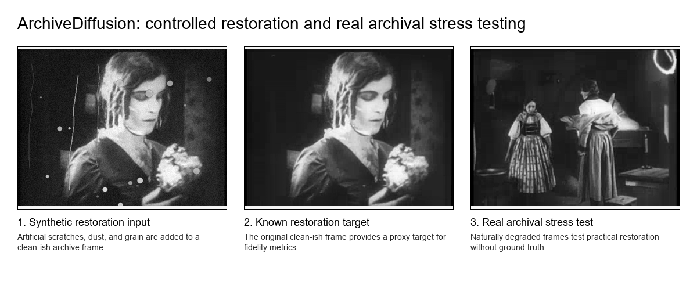
Figure 2: ArchiveDiffusion evaluation regimes.

The figure above shows the two evaluation regimes. In the synthetic setting, artificial scratches, dust, and grain are added to a clean-ish archive frame. The original frame is retained as a known proxy target, enabling fidelity metrics such as PSNR, SSIM, and edge similarity. In the natural archival setting, the model is applied to genuinely degraded frames where no ground-truth restoration exists. These outputs will be evaluated using structured qualitative review focused on blemish reduction, detail preservation, hallucination avoidance, and preservation of archival film texture.

The central goal is not to erase all grain. ArchiveDiffusion treats restoration as an authenticity-preserving generative problem: improving legibility and reducing unwanted degradation while preserving the visual identity of silent-era film.

## 6. Model

This project uses compact diffusion-based restoration models designed for grayscale archival film stills. The models are intentionally small so that they can be trained and evaluated on local hardware while still testing the core modelling question: whether diffusion can remove synthetic degradation while preserving the visual character of public-domain silent-era film.

### 6.1 Image representation

All learned models operate on grayscale 128 × 128 image crops. Images are normalised to a continuous range before training and converted back to image format for evaluation. The use of grayscale reflects the source material and reduces model complexity. The 128 × 128 resolution is a practical compromise: it is small enough for local experimentation, but large enough to show grain, scratches, contrast changes, and local texture.

Each synthetic restoration example consists of two aligned images:

* a degraded input frame (the model condition);
* a clean-ish proxy target frame (the restoration target for supervised training).

### 6.2 Conditional DDPM architecture

The main model is a conditional denoising diffusion probabilistic model. It uses a compact U-Net noise predictor implemented with PyTorch and Hugging Face `diffusers`.

The model is trained to predict Gaussian noise added to the clean-ish target image. At each training step, a timestep is sampled, noise is added to the target image according to the DDPM noise schedule, and the U-Net predicts the noise component. The degraded input frame is concatenated with the noisy target image as an additional channel, so the model receives both the current noisy sample and the image it is supposed to restore.

The conditional DDPM therefore has:

* two input channels: the noisy target sample and the degraded conditioning image;
* one output channel: the predicted noise;
* timestep conditioning: the U-Net receives the diffusion timestep so that it can adapt its prediction to the current noise level;
* an MSE noise-prediction objective.

This design turns the DDPM from an unconditional image generator into a paired restoration model. The degraded input provides scene structure, while the diffusion process learns how to denoise toward the clean-ish archival target.

### 6.3 DDPM scheduler and sampling

The DDPM scheduler defines both the forward noising process used during training and the reverse denoising process used during sampling. During training, the scheduler determines how much Gaussian noise is added at each timestep. During sampling, it uses the model’s predicted noise to update the current sample toward a cleaner image.

At inference time, the model begins from random noise and repeatedly denoises while conditioning on the degraded input frame. The final sample is interpreted as the restored output. Sampling can be run for different numbers of denoising steps, such as 50 or 100, without changing the trained U-Net weights.

### 6.4 Residual DDPM architecture

A residual DDPM variant was also implemented. This model uses the same general conditional diffusion structure, but changes the target being modelled. Instead of learning to generate the full restored image, it learns the residual correction between the degraded input and the clean-ish target.

For each training pair, the residual target is computed as the difference between the target and the degraded input. Noise is added to this residual, and the U-Net learns to predict the noise in the residual sample while conditioning on the degraded input. During sampling, the model generates a residual correction. The final restored image is produced by adding this predicted correction back to the degraded frame.

This architecture is motivated by preservation. A full-image DDPM can, in principle, alter the whole image. A residual model is biased toward learning what needs to change, rather than regenerating the entire frame. This makes it a useful architectural variant for authenticity-preserving restoration, where excessive alteration is a failure mode.

### 6.5 Implementation stack

The project is implemented in Python. Dataset preparation and image processing use OpenCV, PIL, NumPy, and pandas. The diffusion models are implemented with PyTorch and Hugging Face `diffusers`, using `UNet2DModel` and a DDPM scheduler. Experiment tracking uses MLflow with a local SQLite backend.

Training scripts save model checkpoints, scheduler configuration, run configuration, training logs, and validation logs. Sampling scripts produce restored outputs and prediction manifests. Evaluation scripts generate metric summaries, visual grids, blinded human-review sheets, and human-review summary files.

Large generated artefacts such as raw extracted frames, processed datasets, model checkpoints, prediction folders, and MLflow run directories are excluded from Git. The repository keeps the code, documentation, experiment logs, evaluation summaries, review files, and selected figures needed to reproduce the project workflow.

## 7. Experiments

### 7.1 Classical Restoration Baselines

Baseline evaluation shows that simple classical methods behave differently across degradation types. Median filtering is effective for synthetic grain, mask-based inpainting is strong for local scratch/dust artefacts, and none of the simple baselines substantially improves blur/contrast degradation. These results justify reporting metrics by degradation type and motivate diffusion models as a flexible restoration approach, particularly where the restoration requires both local artefact removal and preservation or reconstruction of archival texture.

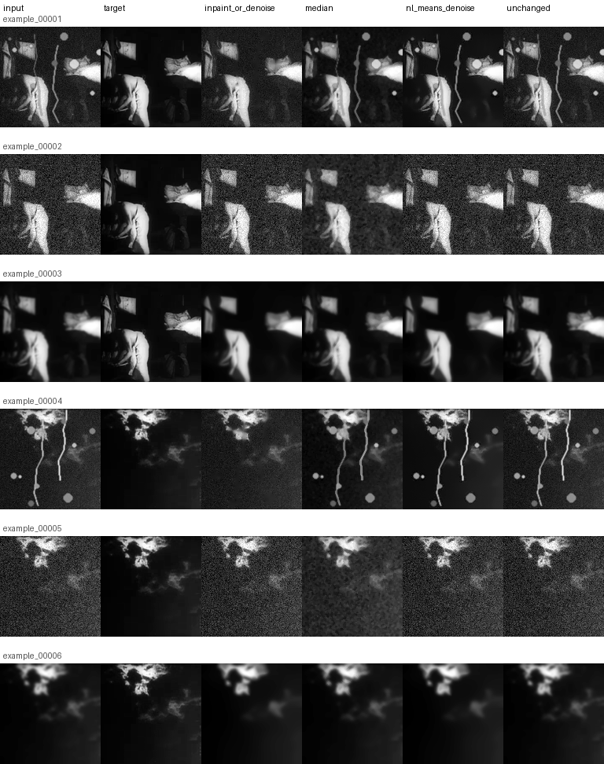
Figure 3: Classical baselines behave differently across degradation types. Median filtering is effective for grain, mask-informed inpainting is strongest for scratch/dust, and none of the simple baselines substantially improves blur/contrast degradation.

### 7.2 Residual DDPM Calibration
Residual DDPM calibration was introduced to test whether restoration quality could be improved by making the model more preservation-oriented. The original conditional DDPM generates a full restored image, which gives it flexibility but also creates a risk of over-editing, smoothing archival texture, or drifting away from the degraded input. The residual variant instead learns the correction between the degraded input and the clean-ish target. During sampling, this predicted correction is added back to the degraded frame to produce the restored output. Two correction strengths were evaluated: a full residual correction and a conservative residual correction. This allowed the experiment to test whether reducing the strength of the learned correction could lower over-smoothing and hallucination risk, or whether it would simply under-correct visible degradation.

### 7.3 Split-aware Training and Validation
Split-aware training was introduced to make the evaluation more reliable. The synthetic dataset contains multiple degraded examples derived from the same underlying source frame, so a random row-level split could place one degradation variant of a frame in the training set and another variant of the same frame in the test set. This would make the test task artificially easier, because the model would already have seen the same scene content during training. To reduce this leakage risk, examples were split by source frame rather than by individual synthetic row. The model was trained only on the training frames, monitored on validation frames, and evaluated on held-out test frames. This makes the results more conservative, but also reduces the amount of visual data available during training, which is important when interpreting the weaker split-aware results.

## 8. Evaluation

Evaluation metrics include PSNR, SSIM, optional LPIPS, edge preservation, texture retention, and qualitative side-by-side comparison.

The high-frequency ratio is used as an initial over-smoothing diagnostic. Values far below 1 indicate loss of texture relative to the target, while values far above 1 indicate excess noise or artefacts. This metric is interpreted alongside PSNR/SSIM because restoration quality is not equivalent to smoothing. Full evaluation results are available in the 'outputs' section of this repo. 

### 8.1 Blinded human review

The initial automatic evaluation suggested that the conditional DDPM outputs were weak relative to classical baselines, particularly under PSNR, SSIM, and MAE. However, visual inspection suggested that the diffusion model was often removing visible blemishes and producing more plausible restorations than these metrics implied. To test whether the evaluation criteria were too pixel-fidelity-driven, I added a blinded human review workflow.

The review covered 21 held-out test examples across blur/contrast, grain, and scratch/dust degradation types, with seven anonymous outputs per example. For each held-out test example, the reviewer (hello!) was shown the degraded input, the synthetic ground-truth target, and one anonymous model output. Method names were hidden during scoring. Each output was rated for artifact removal, detail preservation, texture authenticity, over-smoothing, hallucination risk, overall restoration quality, and whether the reviewer would choose it as a restoration. I tested a 50- and 100-step DDPM trained before implementing the train/test split ("pre-split"), and a 50-step DDPM split-aware model ("post-split").

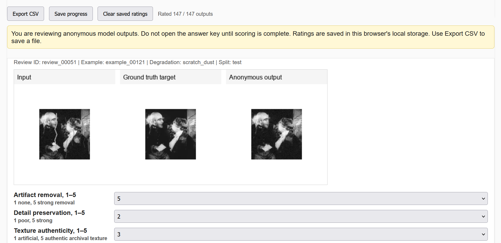
Figure 4: Each blinded review item showed the degraded input, the synthetic target, and one anonymous model output. Method identities were hidden until after scoring.

## 9. Results

### 9.1 Classical baseline results

The classical restoration baselines showed that simple image-processing methods behave very differently across degradation types. Median filtering was most effective for synthetic grain, where smoothing can reduce high-frequency noise without needing to understand the image content. Mask-informed inpainting performed best on scratch/dust examples, especially because it was given access to the synthetic damage mask. This gives it an advantage over methods that must infer damage location from the degraded image alone. None of the classical baselines substantially improved the blur/contrast degradation type, where restoration requires more than local smoothing or mask repair.

These results established two important points. First, restoration performance should be reported by degradation type rather than only as an aggregate score. Second, simple baselines can perform well on narrow synthetic tasks but do not provide a general solution for authenticity-preserving archival restoration. In particular, methods that improve PSNR or MAE can still produce visually over-smoothed outputs that are not preferred in human review.

### 9.2 Conditional DDPM restoration results

The conditional DDPM was introduced as a learned restoration model that uses the degraded input frame as conditioning information. The model receives a noisy version of the clean-ish target frame at a diffusion timestep, concatenated with the degraded input frame, and learns to predict the noise added to the target. At sampling time, it starts from noise and iteratively denoises toward a restored image while using the degraded frame as guidance.

The initial DDPM outputs were visually more promising than the automatic metrics alone suggested. In several examples, the diffusion model reduced visible degradation and produced more plausible restored frames than classical filters, while preserving more image structure than aggressive denoising baselines. However, pixel-level metrics such as PSNR, SSIM, and MAE often penalised these outputs because diffusion restorations were not perfectly pixel-aligned with the synthetic target. This was especially important for archival restoration, where a visually plausible restoration can differ from the proxy target without necessarily being worse.

The comparison between 50-step and 100-step DDPM sampling showed that longer sampling was not clearly beneficial in human review. The 100-step model achieved the highest mean overall score in the first review, but the 50-step model was effectively tied. This suggests that, for the current model and dataset scale, sampling length is not the main bottleneck. Future comparisons therefore use 50-step sampling as the default unless there is a clear reason to test longer sampling.

  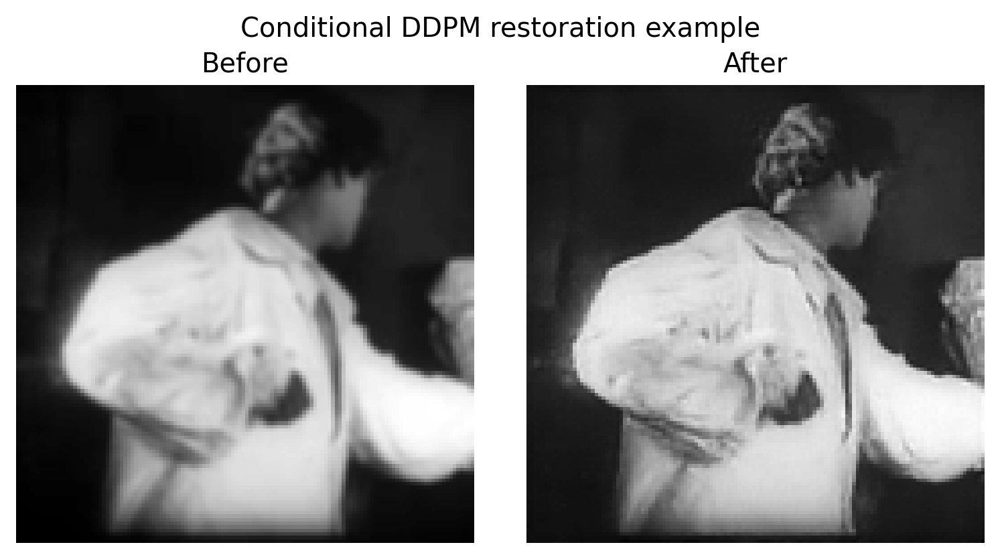

Figure 5: conditional DDPM successful cleaning example.

  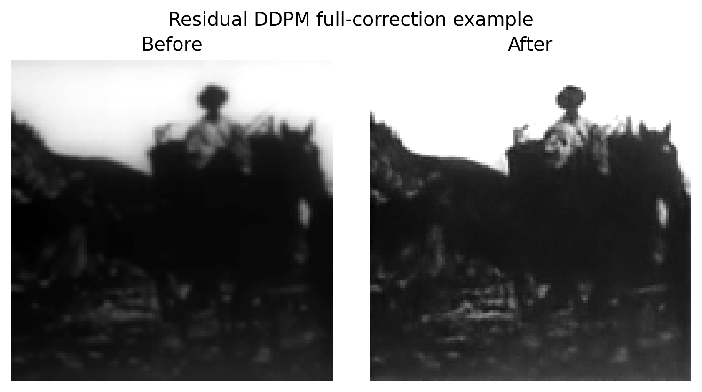

Figure 6: residual DDPM successful cleaning example.

### 9.3 Automatic metrics versus human judgement

The first blinded human review showed a clear mismatch between automatic fidelity metrics and human-perceived restoration quality. Classical baselines could score well under pixel-level metrics while still appearing over-smoothed or visually unconvincing. Conversely, DDPM outputs were sometimes penalised by PSNR, SSIM, and MAE despite being preferred by the reviewer.

The results showed that the DDPM outputs were preferred more often than the automatic metrics suggested. The pre-split 50-step and 100-step DDPM samplers achieved the highest mean overall human scores, with the 100-step sampler receiving the highest yes/maybe restoration-choice rate. Classical median and non-local-means baselines were rated poorly, even though they can perform well on pixel-level metrics. This suggests that PSNR and SSIM alone over-reward conservative smoothing and under-value perceptually useful restoration. The post-split model achieved weaker human-review results than the pre-split DDPM references (average score of 2.7 across the metrics compared to the best baseline of 2.4 for inpainting). This should not be interpreted as definitive evidence of overfitting, because the train/validation loss curves did not show a clear overfitting pattern. A more plausible explanation is reduced data exposure: the split-aware model was trained on fewer source frames than the earlier full-data model. This result motivates larger split-aware training data rather than simply longer training.

This motivated a two-layer evaluation protocol. Automatic metrics remain useful for detecting structural drift, excessive smoothing, and changes outside damaged regions. However, they are not sufficient as the final measure of restoration quality. Blinded human review was therefore used to assess artifact removal, detail preservation, texture authenticity, over-smoothing, hallucination risk, overall restoration quality, and whether an output would be chosen for restoration.

The results were degradation-specific. Diffusion outputs were preferred for blur/contrast and grain examples, where classical filters often produced over-smoothed or visually unconvincing results. For scratch/dust examples, the mask-informed inpainting baseline remained strongest, which is expected because it has access to the synthetic damage mask. This highlights the need to report restoration performance by degradation type and to distinguish mask-informed baselines from methods that operate without oracle damage information.

### 9.4 Model calibration: conditional DDPM versus residual DDPM

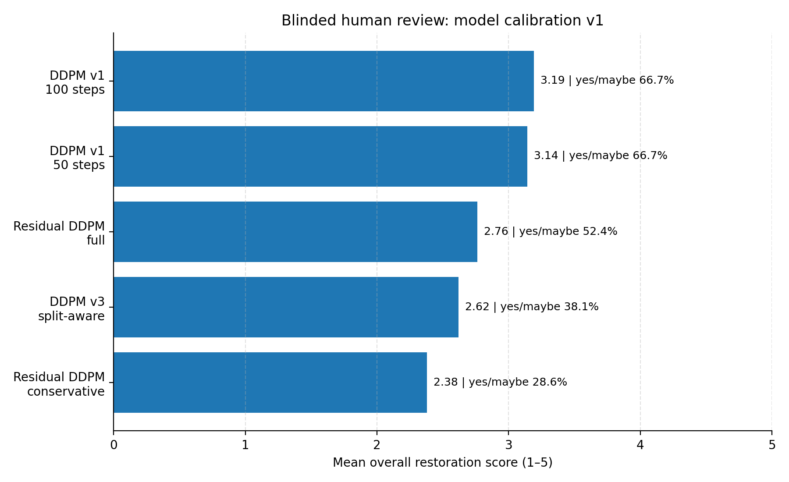
Figure 7: performance by model run.
The earlier DDPM references remained strongest in the harder diffusion-only review. Residual DDPM full correction was the strongest new variant, while conservative residual correction reduced over-editing risk but under-corrected visible degradation.

After the first review showed that DDPM outputs were preferred over classical baselines, a second, harder blinded review compared only diffusion variants. This model-calibration review tested whether the earlier preference for DDPM remained when the comparison set no longer included weak classical baselines. It compared five outputs per held-out test example: the previous split-aware 50-step DDPM reference, the previous non-split-aware 100-step DDPM reference, a longer split-aware conditional DDPM, residual DDPM with full correction, and residual DDPM with conservative correction.

The earlier DDPM references remained strongest in this harder comparison. `conditional_ddpm_v1_100_steps` achieved the highest mean overall human score, 3.19 / 5, while `conditional_ddpm_v1_50_steps` was effectively tied at 3.14 / 5. Both had a yes/maybe restoration-choice rate of 66.7%. This suggests that the earlier preference for DDPM was not only caused by comparison against weak classical baselines. The earlier DDPM outputs remained competitive even when compared against newer diffusion variants.

The new variants were informative but did not outperform the earlier DDPM references. The residual DDPM full-correction model was the strongest new variant, with a mean overall score of 2.76 and a yes/maybe rate of 52.4%. The longer split-aware conditional DDPM scored 2.62 overall with a yes/maybe rate of 38.1%. The conservative residual DDPM scored lowest overall, 2.38, although it had the lowest over-smoothing and hallucination-risk ratings. This suggests that conservative residual correction did reduce some risks associated with over-editing, but at the cost of insufficient artifact removal.

Overall, the calibration review suggests that the main limitation is unlikely to be sampling length alone. The earlier 50-step and 100-step DDPM outputs remained very close in human evaluation, while the longer split-aware run did not close the gap to the earlier non-split-aware models. A plausible explanation is reduced data exposure: the split-aware models were trained on fewer source frames than the original full-data DDPM references. The next priority would therefore be to expand the training dataset while preserving split-aware evaluation.

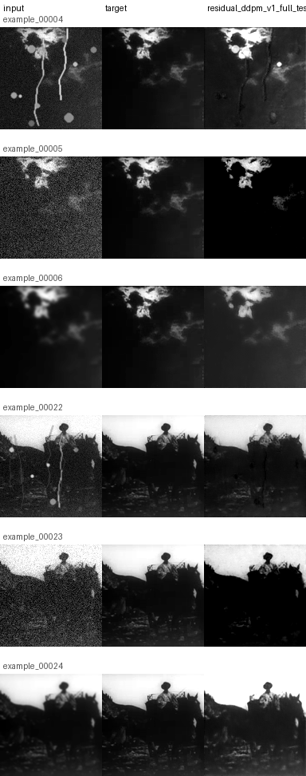
Figure 8: Residual DDPM with split awareness generally performed poorly.

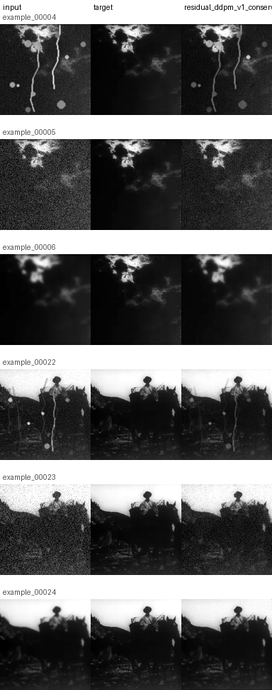
Figure 9: Full residual correction was more visually competitive, while conservative correction reduced over-editing risk but often under-corrected visible degradation.

### 9.5 Training and validation loss analysis

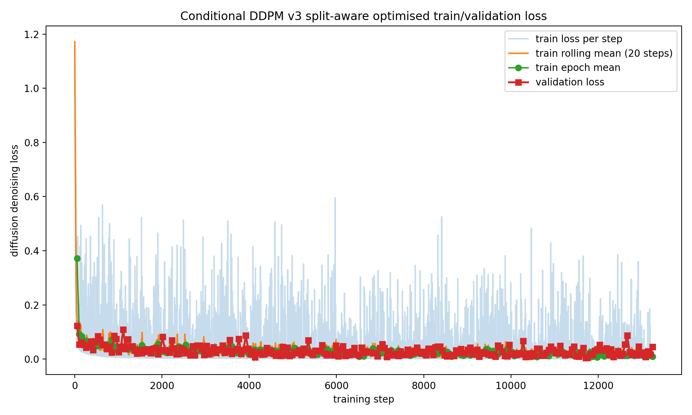
Figure 10: Train and validation denoising losses decline together, suggesting that the split-aware model is learning the diffusion objective without obvious classical overfitting. The weaker human-review performance therefore points toward data exposure or objective alignment rather than simple overfitting.

Training and validation loss curves were used as optimisation diagnostics, but not as the final measure of restoration quality. For the split-aware DDPM models, train and validation denoising losses declined together without a clear pattern of classical overfitting. This means the weaker split-aware human-review performance should not be interpreted as definitive evidence that the model simply overfit the training set. Instead, the results point toward a combination of reduced data exposure and objective mismatch.

The residual DDPM results support the same interpretation. The residual model can learn its denoising objective, but the human review shows that the learned correction must be balanced carefully. Full residual correction was more competitive, while conservative residual correction reduced over-smoothing and hallucination-risk ratings but under-corrected visible degradation. This indicates that lower denoising loss does not automatically imply better restoration quality.

These findings reinforce the need to evaluate restoration models with both quantitative diagnostics and human-calibrated criteria. The denoising objective is useful for training a diffusion model, but it does not directly optimise artifact removal, archival texture preservation, or reviewer preference. Future work should therefore focus on larger and more diverse training data, more realistic degradation modelling, adaptive residual correction, and metrics that better align with human judgements of authenticity-preserving restoration.

## 10. Failure cases

The main failure mode across the diffusion models was not complete restoration failure, but imbalance between artifact removal and preservation. Some DDPM outputs removed visible degradation but also changed the image more globally than desired. In an archival setting, this is a significant issue because excessive smoothing or structural drift can reduce the historical texture of the image, even if the output appears cleaner.

Scratch/dust examples remained especially difficult. Classical mask-informed inpainting performed strongly on these examples because it had access to the synthetic damage mask, while the diffusion models had to infer both the damage location and the appropriate restoration. This suggests that local damage repair may require explicit damage localisation, mask conditioning, or a two-stage pipeline that separates damage detection from restoration.

The residual DDPM experiments revealed a second failure mode: under-correction. The conservative residual model had the lowest over-smoothing and hallucination-risk ratings, but it also received the weakest overall restoration scores. This suggests that simply constraining the model to make smaller changes is not sufficient. Authenticity-preserving restoration requires a balance between preserving original texture and making enough correction to visibly improve the damaged frame.

The split-aware models also underperformed the earlier full-data DDPM references. This should not be interpreted as definitive proof of overfitting in the earlier models. The train/validation curves did not show clear classical overfitting. A more plausible explanation is that the split-aware models had less visual exposure because the training set was smaller after grouping frames into train, validation, and test splits. This indicates that the current dataset is too small to fully support a robust split-aware diffusion model.

Finally, the evaluation itself has limitations. The human reviews were blinded and structured, but they were conducted by a single reviewer. This makes them valuable for calibration, but not a definitive measure of general human preference. Future work should include multiple reviewers, fixed review sets, and inter-rater agreement to separate model performance from reviewer-specific judgement. Much more on this in Section 11.

  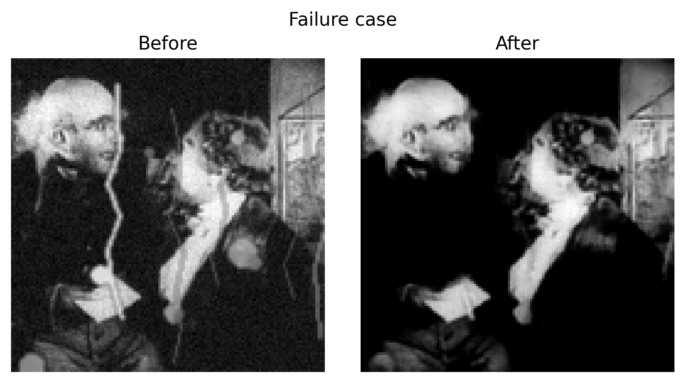

Figure 11: Representative failure case. In difficult examples, especially scratch/dust or conservative residual settings, the model may under-correct visible degradation or fail to preserve local structure cleanly.

The conservative residual model reduced some risks of over-editing, but in several examples it under-corrected visible degradation and received lower overall restoration scores.

    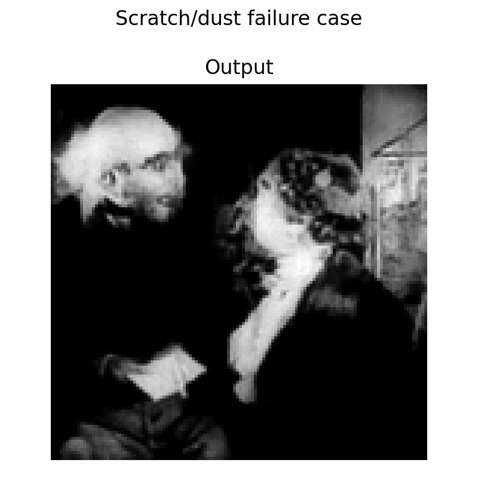

Figure 12: Scratch/dust remained one of the hardest degradation types, especially for methods without explicit damage-mask conditioning.

## 11. Responsible use and limitations

ArchiveDiffusion is designed as an authenticity-preserving restoration prototype, not as a tool for producing historically verified reconstructions. Restored outputs should be interpreted as plausible enhancements generated by a model, not as evidence of what the original film frame definitively looked like. This distinction is important because generative models can hallucinate detail, remove historically meaningful texture, or introduce visual changes that appear plausible but are not grounded in the source material.

The project therefore treats restoration as a constrained and reviewable process. Before/after comparisons should be preserved, and restored images should not be presented without reference to the original degraded frame. Any practical restoration workflow should record the source material, degradation process, model version, sampling settings, and review decisions. This is especially important for archival media, where visual changes can affect interpretation of historical material.

The current system has several technical limitations. It was trained on a small dataset derived from one public-domain film, so it may learn film-specific visual characteristics rather than a general archival restoration prior. The synthetic degradation process approximates grain, blur, contrast loss, scratches, and dust, but does not capture the full complexity of real film damage such as flicker, gate weave, emulsion damage, uneven exposure, and compression history. The model also operates on low-resolution grayscale frames, which limits its ability to preserve fine detail.

Evaluation is another limitation. PSNR, SSIM, MAE, and related pixel-level metrics are useful diagnostics, but they do not fully capture perceived restoration quality or archival authenticity. Blinded human review helped address this gap, but the review process used a single reviewer and should be treated as calibration rather than definitive ground truth. Future work should include multiple reviewers, stronger perceptual metrics, and explicit analysis of agreement between automatic metrics and human preference.

There are several best-practice behaviours that were flagrantly ignored as I prioritised getting the system up and running. In no particular order: 

(i) The train/test/val split should have been implemented from day 1, and more images ingested to compensate for the fall in data breadth; 
(ii) While I did put effort into creating meaningful baselines at the start of the project, I could have spent more time on this. In the first human review, comparing against individual out-of-the-box restoration techniques (e.g. inpainting) was disingenous (a more accurate comparison would be against all of the restoration techniques applied consecutively);
(iii) I should definitely not have been the reviewer, as this could lead to bias! I aimed to mitigate bias and review truthfully, but in future iterations I will blind this aspect of the process and enroll helpers;
(iv) Many, many more minor issues.

The project uses public-domain source material and is intended for research and portfolio demonstration. Any extension to broader archival restoration should respect copyright, provenance, institutional archive policies, and the ethical distinction between restoration and creative enhancement. The safest deployment model would be human-in-the-loop: the model proposes candidate restorations, while human reviewers assess whether the output improves legibility without compromising authenticity.

## 12. Next steps and future work

The current ArchiveDiffusion pilot demonstrates that conditional diffusion can produce visually meaningful archival restoration outputs, but the experiments also identify several clear limitations. In a very rough order of importance, the next steps I would take with more time are as follows: 

(1) The strongest next step is to expand the training data. The split-aware models underperformed the earlier full-data DDPM references, suggesting that reduced data exposure is now a central bottleneck. Future versions should use more clean-ish source frames, multiple synthetic degradation variants per frame, and additional public-domain archival films beyond *Nosferatu*. Splits should remain grouped by source frame to avoid leakage.

(2) I have not yet tested restoration on actual blemishes in the original Nosferatu recording, such as those in Figure 2, which was the whole point of the project! So including such examples in the test set is a vital next step. This ties into a broader goal of improving the realism of the synthetic degradation process. The current degradations are sufficient for a proof of concept, but archival film damage includes more complex scratches, dust bursts, compression artifacts, exposure flicker, gate weave, local blur, vignetting, and emulsion damage. Modelling these effects more accurately would make synthetic supervision more relevant to naturally degraded archival frames. 

(3) Closely related, much more data and more frames! The training loss converges quickly on this data set, and gets passable results on a small selection of frames. I would like to build this on more German horror films from the 1920s and see how well it scales not just to an unseen frame, but an unseen film. More ambitiously, how does this work when colour gets involved and we're not just working with greyscale images?

(4) More models! The modelling pipeline should be extended beyond full-image conditional DDPM. Residual DDPM provided a useful test of whether restoration corrections could reduce over-editing, but the conservative setting under-corrected and the full setting did not outperform the earlier DDPM references. Future work should explore adaptive residual correction strength, damage-mask conditioning, DDIM sampling, Palette-style image-to-image diffusion, and latent diffusion for higher-resolution restoration. Stronger neural restoration baselines, such as U-Net or transformer-based restoration models, should also be added to make the comparison more rigorous. Multimodal models could assist by classifying degradation type, identifying likely damage regions, and triaging examples for review, while human judgment remains central to decisions about archival authenticity. This would move the project from a modelling prototype toward a responsible applied GenAI workflow for authenticity-preserving archival restoration.

(5) Evaluation remains a core research challenge. The blinded human reviews showed that PSNR, SSIM, and MAE do not fully capture perceived restoration quality. Future work should therefore treat human review as a calibration layer rather than an optional add-on. A fixed review set, multiple reviewers, inter-rater agreement, and correlations between human preference and automatic metrics would strengthen the evaluation protocol. Additional perceptual and texture-aware metrics should also be added, especially measures that distinguish artifact removal from over-smoothing, hallucination, and unwanted changes outside damaged regions.

(6) Something more dynamic than a report write-up! The dream is to create an interactive tool that presents several frames from several models, including the real frame - and the user has to guess which one is real. If they're anything less than 100% accurate, we've done well.
